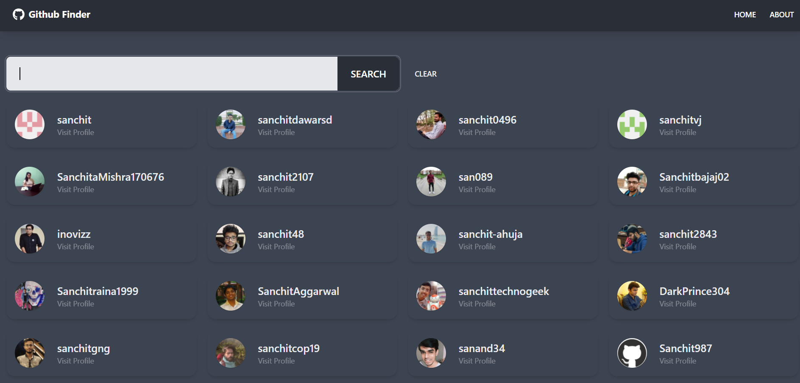
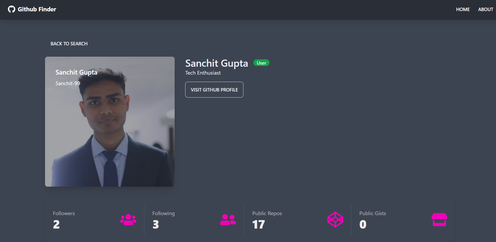

# Github Finder

This is a Web app built using React.js, It uses the official Github API to fetch the details of the users by their username and display in a custom build UI, which uses tailwind CSS and daisy UI.

This project was built undeer the guidance of Brad Traversy's course React - Front to Back.

## Deployed on Heroku

https://github-finder-675.herokuapp.com/

## Screenshots

## Environment Variables

To run this project, you will need to add the following environment variables to your .env file

`REACT_APP_GITHUB_URL` with the value `https://api.github.com` 

`REACT_APP_GITHUB_TOKEN` with your github access token.

